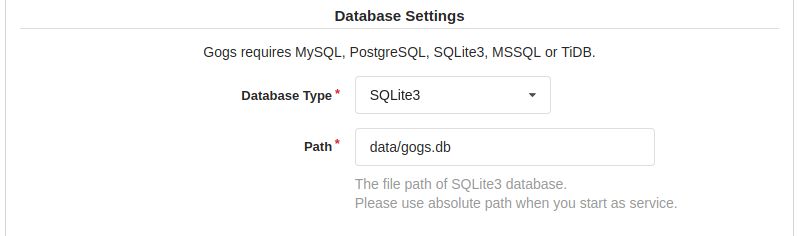
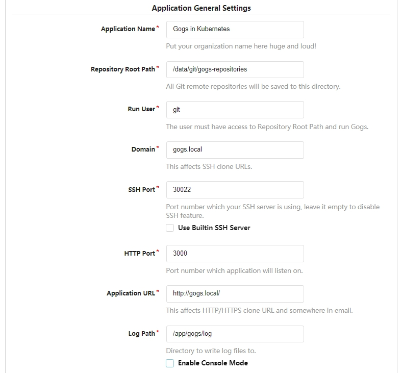
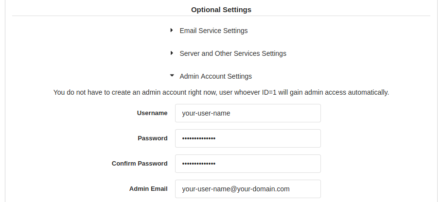

# Install Gogs in Kubernetes #

The following installation steps will create a working Git server in Kubernetes.

## Installation ##

Use the script [gogs.yaml](gogs.yaml) to create all Kubernetes entities needed.

Run the script with:

```shell
$ kubectl apply -f gogs.yaml

namespace/gogs created
persistentvolumeclaim/gogs-pv-claim created
deployment.extensions/gogs created
service/gogs-svc created
```

Depending on your needs, you may want to modify:

- size of the persistent volume (currently `2GB`)
- Gogs Docker image (currently `gogs/gogs:0.12.10`)
- number of replicas
- turn the Deployment into a StatefulSet or a DaemonSet

## Access to Gogs ##

You may access Gogs in 2 ways:

- via web interface that is similar with Github
- via SSH using git command line

If you use Minikube then you should add the local address of Gogs to /etc/hosts with the following command:

```shell
echo -e "\n"$(minikube ip)" gogs.local" | sudo tee -a /etc/hosts
```

### Access via web interface ###

In order to access the Gogs web interface you have the following options:

- via an Ingress (uncomment the ingress section in [gogs.yaml](gogs.yaml))
- via an Istio gateway - run the script [istio.yaml](istio.yaml) to create the Istio entities needed. For this option you will need to previously [install Istio](https://github.com/drabo/istio)

```shell
$ kubectl apply -f istio.yaml

gateway.networking.istio.io/gogs-gateway created
virtualservice.networking.istio.io/gogs-vs created
```

#### Gogs Configuration via web interface ####

Access in your browser the link: http://gogs.local

**Database Settings:**

For simplicity choose `SQLite3`



**Application General Settings:**

- Domain: `gogs.local`
- SSH Port: `30022`
- HTTP Port: `3000`
- Application URL: `http://gogs.local/`



**Optional Settings:**

Expand *Admin Account Settings* and create an admin user:

- Username: `your-user-name`
- Password: `your-password`
- Email: `your-email-address` or a dummy address



> :exclamation: Upload the public key to your Gogs user that will be useful for SSH access.

### Access via SSH ###

Create the following entry into your `~/.ssh/config` file:

```shell
Host gogs.local
    HostName gogs.local
    Port 30022
    User git
```

Test the SSH conection to Gogs:

```shell
$ ssh gogs.local

Warning: Permanently added the ECDSA host key for IP address '[192.168.99.100]:30022' to the list of known hosts.
PTY allocation request failed on channel 0
Hi there, You've successfully authenticated, but Gogs does not provide shell access.
If this is unexpected, please log in with password and setup Gogs under another user.
Connection to gogs.local closed.
```

More information about the Docker for Gogs on page https://github.com/gogs/gogs/tree/master/docker

## Gogs for ARM64 ##

If you have a Kubernetes cluster running on a Raspberry Pi 4 with 8GB RAM or a server in cloud running ARM64 processor then Gogs may be installed by using the deployment script [gogs-arm64.yaml](gogs-arm64.yaml)
